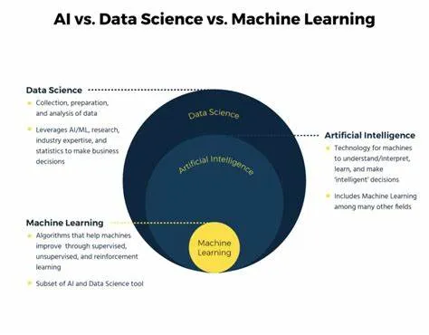

Artificial Intelligence. Robots. They are taking over our jobs!!

These are the terms I always hear from non — technical people, and also technical people. I was also afraid of this when I first heard of it. Well, my job is going to be taken over by a delusional machine.

I attended a software testing conference, (STARWEST) around 2018 and heard of AI taking over software testing, and software development teams may no longer need the services of a software QA. They presented a lot of AI tools that would help in testing. I studied each and every one of them and I learned, these ‘tools’ will actually not replace the person, but it will help the person. Just like how all these tools that we are currently using, but maybe, smarter!

I love learning and this is why I went back to school to help me organize my way of thinking and mingle with like-minded people. The courses threw me these terms: Machine Learning. AI. Data Science. Data Analysis.

To make it easier for me to explain these terms in a simple way, here’s what I’ve found in the industry definitions and what it means to a kid:

## Data Science: 
it is a field that studies data and how to extract meaning from it, using a series of methods, algorithms, systems and tools to extract insights from structured and unstructured data. These would help businesses, government and other organizations to drive profits, innovate products and services, or build better infrastructures, and more! (Data Science vs. Machine Learning: What’s the Difference? | Coursera)

### Data Science to a Kid:
Let’s say we have a big box of blocks. Each block represents information about something — there are animals, buildings, little men and women with tiny kids. As a kid, you organize and understand the blocks. You sort them by their colors and shapes, and then you find out interesting things like which color is the most common or which shapes fit together the best! When it comes to businesses, think about building roads or buildings. Businesses have their own big boxes of blocks. As a kid, you figure out how to make better roads by looking at the blocks. By using this analysis, you’ve just figured out something important!

Just like how data scientists use a special tool to understand information, our brain is the data science tool that helps decide how to make businesses better.

## Machine Learning: 
It is a branch of artificial intelligence that uses algorithms to extract data and the predict future trends. A software is programmed with models (or algorithms) that allow engineers to conduct statistical analysists to understand patterns in the data. (Data Science vs. Machine Learning: What’s the Difference? | Coursera)

### Machine Learning to a Kid: 
Let’s say you have a friend. This friend can look at a lot of pictures of animals and learn to tell the difference between cats, dogs and birds. It does this by looking at the colors and shapes in the picture. When you show this friend a new picture, like a lion, it can guess what kind of animal it is. How did the kid friend do this? By teaching them! You teach the friend to be good at guessing, by giving them a lot of pictures to practice. They use Patterns in the data — which is the picture. In simple terms, Machine learning is teaching a kid to learn and get better at guessing things by looking at lots of pictures and finding patterns.

## Artificial Intelligence: 
It focuses on giving the machines cognitive and intellectual capabilities similar to those of humans, or capable of augmenting or replacing humans in specific tasks and workflows. (Data Science vs. Machine Learning vs. AI: How They Work Together (techtarget.com))

### Artificial Intelligence to a Kid: 
You are teaching a computer to think and learn like a smart grown up. The computer can help with important jobs and tasks, and sometimes it can do things almost as well as a grown-up can. So, it’s like making a computer super smart to help us with lots of stuff!

In summary:

Data Science is like being a detective for information, finding hidden treasures in a room full of toys.

Machine Learning is training a very clever pet to tell animals apart by looking at pictures and finding patterns.

Artificial Intelligence is like making a computer so smart so it can help with important tasks almost like a grown up.

So why are they related? Without Data and preparation, or without the right ingredients, we cannot make a robot clever. Without Machine Learning, we cannot make the robot clever by not training them. Without these two, Artificial Intelligence is not intelligent. They all have to work together to be smart.

The question at hand is whether these terms evoke fear or excitement, considering that we are undeniably within the midst of the Fourth Industrial Revolution.

References:
- https://www.coursera.org/articles/data-science-vs-machine-learning
- https://www.techtarget.com/searchbusinessanalytics/feature/Data-science-vs-machine-learning-vs-AI-How-they-work-together
