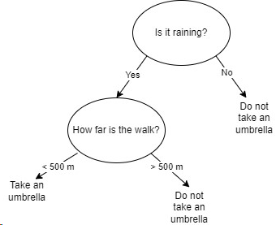
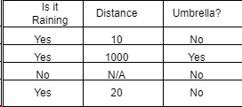
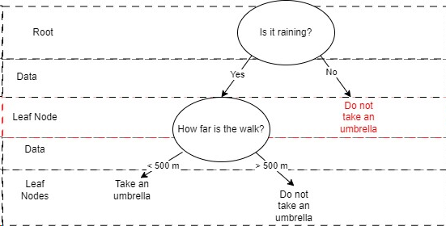
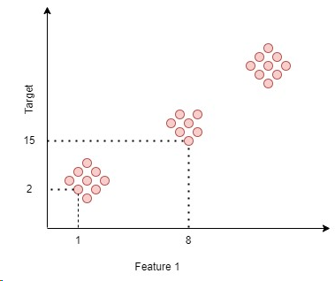
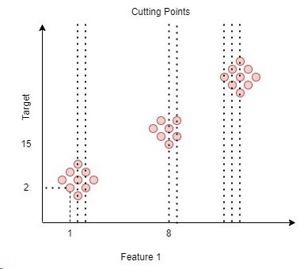
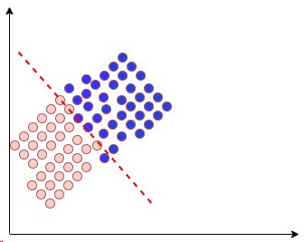

## Decision Trees

How do decision trees operate in the context of Machine Learning? Essentially, they mimic our decision-making processes. For instance, consider the decision of whether to carry an umbrella when stepping outside in the rain as an example.

To interpret the decision tree, I made use of the decision tree table below:

How do individuals make the decision to carry an umbrella, taking into account factors beyond just the current weather conditions? This decision often draws from their past experiences, essentially using their previous encounters as a dataset.

The entire table presented above serves as this dataset, with the columns "Is it raining" and "Distance" being referred to as features, while "Umbrella" is designated as the target variable. In real-life scenarios, we encounter more than just three columns of data. The decision tree algorithm excels at determining which columns are essential for the decision-making process, effectively disregarding those that are not useful to the outcome.

The decision tree process is:
1. Choose the best feature - which creates the 'root'
2. Split the dataset - it decides on yes or no; it sets the data points where it answers the question is it raining.
3. Repeats 1 and 2 until;
4. We decide on what to do, which stops at the leaf nodes.

When a leaf node is described as "pure," it means that it exclusively contains one single value. For instance, in the decision tree we've depicted, if we focus on the "NO" category, the final leaf represents a pure leaf node, as it doesn't branch off into further decisions and contains only a single result.

When dealing with Decision tree problems, we ask these questions:

What makes a feature the "best" one? How is this determined? When dealing with continuous variables, how does the splitting work? In our table, "Is it Raining" has two values, while "Distance" is continuous. How are splits handled with categorical values?

The last question would be the difference between approaches of classification and regression and how do they happen?

### Best Feature Selection

The two main approaches for classification problem are CART and ID3.

CART is being used by default when you start using scikit learn library. The main differences are the following:

| CART | ID3 |
| -------- | -------- |
| GINI Index (Impurity) | Entropy + Information Gain |
|  Gini(D) = 1 - Σ(pᵢ)²  | H(D) =  - Σ(pᵢ * log₂(pᵢ))  + Information Gain  |
| Separates in a binary way; either 1 or 0 only | Can have more than two possibilities; great with data that uses more than 2 categories |
| | |

*Information Gain:* Entropy(before the split) - Entropy(after the split)

*Gini Index:*
Gini Impurity serves as a measure to assess the purity of a resulting node. When a split results in just one type of leaf node, it results in a low Gini index after the split. The Gini formula, Gini(D) = 1 - Σ(pᵢ)², is defined with p representing probabilities.

How do we compute the GINI Index using a tabular approach? The table presented below displays values for Feature 1, Feature 2, and the target variable, which can encompass various labels. To calculate the GINI Index, we evaluate each row individually, exploring the consequences of choosing different features (e.g., A, B, or C). We then examine the purity of the resulting subsets for each feature, with lower purity indices indicating a better feature.

<table>
  <tr >
    <td>Feature 1</td>
    <td>Feature 2</td>
    <td>Target</td>
  </tr>
  <tr style="background-color: yellow;">
    <td>A</td>
    <td>0</td>
    <td>A</td>
  </tr>
  <tr>
    <td>B</td>
    <td>1</td>
    <td>A</td>
  </tr>
  <tr>
    <td>C</td>
    <td>1</td>
    <td>A</td>
 </tr>
 <tr style="background-color: yellow;">
    <td>A</td>
    <td>1</td>
    <td>1</td>
 </tr>
 <tr>
    <td>B</td>
    <td>0</td>
    <td>B</td>
 </tr>
</table>

In the process of calculating the GINI Index, we evaluate the purity of subsets that result from using each feature as a decision point and aim to identify the feature that results in the lowest purity index, indicating the best choice for splitting the data.

*Entropy Concept:*
What is randomness? Take a coin toss, for instance. There's a 50/50 chance of getting either heads (0) or tails (1). This is when entropy is highest. When the outcome is more certain, the entropy is lower. The formula is H(D) =  - Σ(pᵢ * log₂(pᵢ)) where p is the probability of the certain category

In the table provided, for simplicity, when determining a split point, such as when a value is less than 4 or greater than 4, the process involves calculating the average and subsequently evaluating the entropy. A higher information gain indicates a greater level of purity.

<table>
  <tr >
    <td>Feature 1</td>
    <td>Average</td>
    <td>Target</td>
  </tr>
  <tr>
    <td>2</td>
    <td>3 (2 and 4)</td>
    <td>0</td>
  </tr>
  <tr>
    <td>4</td>
    <td>5 (4 and 6)</td>
    <td>1</td>
  </tr>
  <tr>
    <td>6</td>
    <td>7 (6 and 8)</td>
    <td>1</td>
 </tr>
 <tr>
    <td>8</td>
    <td></td>
    <td>0</td>
 </tr>
</table>

**Basically, the decision tree is using a greedy algorithm, because it repetitively calculates best feature**

### Regression

In the classification approach, we identify the optimal feature by comparing the information gain across various features. In the regression approach, the best feature is determined by minimizing the error. But, how do we pinpoint that feature? Do we divide the data at specific data points on the graph? And if so, which side of the graph should we choose?

What we do is assess these dividing points. Each data point below a dividing point receives the average of all the values close to it.

Suppose we have the following errors:

| Dividing Point | Error | Value |
| -------- | -------- | -------- |
| Dividing Point 1 | Error1 (Sum of errors / number of errors) | 0.04 |
| Dividing Point 2 | Error2 (Sum of errors / number of errors) | 0.002 |
| Dividing Point 3 | Error3 (Sum of errors / number of errors) | 0.03 |
| Dividing Point 4 | Error4 (Sum of errors / number of errors) | 0.0001 |

In this case, Dividing Point 4 yields the lowest error.

To know more about Regression, head over to: https://github.com/ivymorenomt/mlNotes/blob/main/Predictive%20Models.ipynb

## Overfitting

When overfitting occurs, it often looks like this:

You end up overly relying on the dataset, which can lead to  issues. It's essential not to be too specific and avoid overgeneralization. When faced with this situation, pruning is a recommended approach.

Pruning doesn't aim to precisely predict all data points, but it does help create a machine learning model that doesn't suffer from overfitting.

Setting stopping criteria is another critical aspect. This involves defining how deep the decision tree goes before the leaf nodes become pure.

Additionally, consider using ensemble methods. They involve moving beyond a single decision tree.

For instance, in the case of Random Forest, you combine multiple decision trees, resulting in more accurate predictions.

So, why opt for decision trees or not? Keep in mind that if you change the dataset, the generated decision tree can change significantly. Decision trees are known for their sensitivity to data variations.

## How to use Decision Trees?

Decision trees can be used for both classification and regression tasks in machine learning. The choice between classification and regression depends on the nature of the problem you are trying to solve and the type of data you have.

1. **Classification**:
   - Use classification with decision trees when your task involves categorizing or labeling data into distinct classes or categories. For example, determining whether an email is spam or not spam, classifying images of animals into different species, or predicting whether a patient has a particular disease or not.

   - The target variable in classification is categorical. You are making discrete, class-based predictions.

2. **Regression**:
   - Use regression with decision trees when your task involves predicting a continuous numerical value. For example, predicting house prices, estimating the amount of rainfall, or forecasting the temperature.

   - The target variable in regression is continuous, and the model generates a numerical output that can take on a range of values.

**How to Determine the Task**:
When deciding whether you are solving a classification or regression problem with a decision tree, consider the following:

1. **Target Variable Type**: Examine the type of the target variable in your dataset. If it's categorical with distinct classes, it's a classification problem. If it's numerical or continuous, it's a regression problem.

2. **Problem Statement**: Consider the problem you want to address. Are you trying to assign data points to specific categories (classification) or predict a value (regression)?

3. **Data Exploration**: Visualize and explore your data. This can often give you insights into the nature of the problem. If you see discrete classes, it's likely a classification problem. If you see a continuous spread of values, it's probably a regression problem.

4. **Problem Domain**: Your domain knowledge can also guide you. Understanding the problem you're working on can help you decide whether classification or regression is more appropriate.

In some cases, it's possible to frame a problem as both a classification and regression task. For example, predicting customer satisfaction on a scale of 1 to 5 could be treated as a classification problem (e.g., satisfied, neutral, dissatisfied), or as a regression problem to predict the numerical score directly. The choice depends on how you want to interpret and use the results.