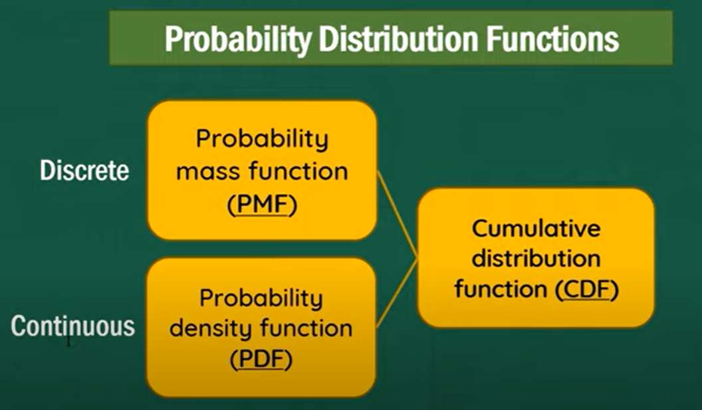
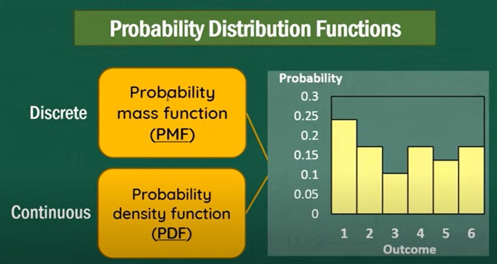
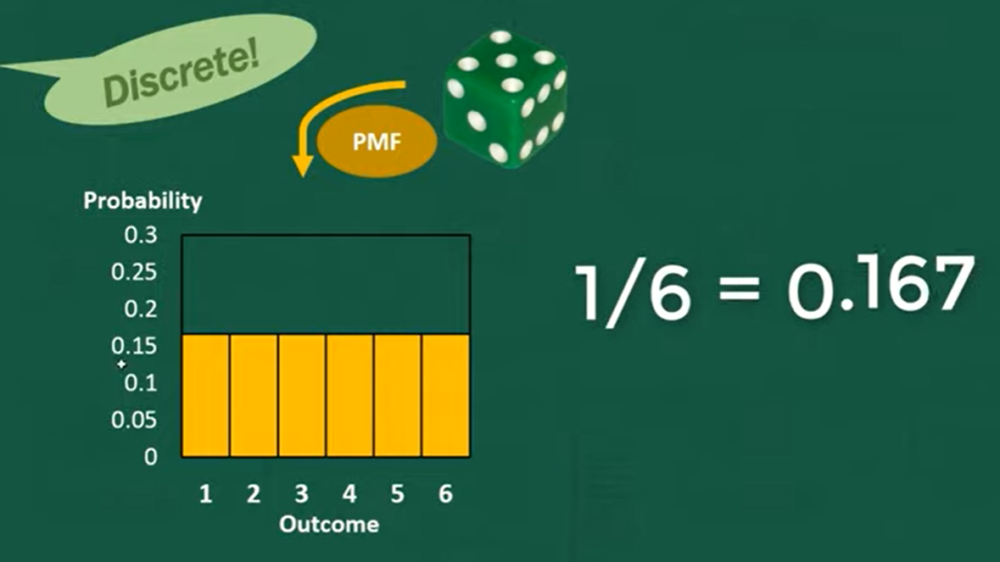
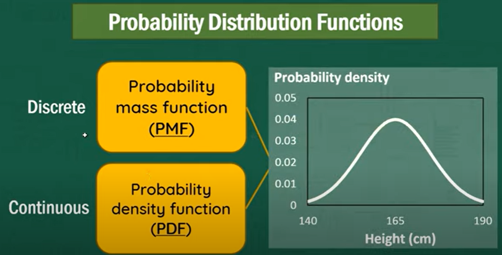

## Probability and Statistics Refresher

Statistics and probability play a crucial role in machine learning for several reasons:

1. **Data Analysis**: Machine learning models are trained on data, and statistical methods are essential for analyzing and understanding the underlying patterns and characteristics of the data. Probability distributions can help model the uncertainty and variability in the data.

2. **Model Selection and Evaluation**: Statistics provides techniques for selecting the most appropriate machine learning model for a given problem. It helps in comparing different models, assessing their performance, and making informed decisions about which model to deploy.

3. **Feature Selection and Engineering**: Statistical methods help in identifying relevant features (variables) for a machine learning task and creating new features to improve model performance. Feature selection and engineering are critical steps in the data preprocessing phase.

4. **Inference and Hypothesis Testing**: In some machine learning applications, especially in scientific research and medical diagnostics, statistical inference and hypothesis testing are used to make conclusions about populations and test the significance of relationships between variables.

5. **Dealing with Uncertainty**: Probability theory is fundamental for dealing with uncertainty and making probabilistic predictions. Many machine learning algorithms, such as Bayesian networks and probabilistic graphical models, explicitly model uncertainty and make probabilistic predictions.

6. **Overfitting and Regularization**: Statistics helps in understanding the concepts of overfitting and regularization. Techniques like cross-validation and regularization methods (e.g., L1 and L2 regularization) are employed to prevent overfitting and improve model generalization.

7. **Probability Distributions**: Probability distributions, such as Gaussian (normal), Poisson, and Bernoulli distributions, are used to model various aspects of data, including noise, errors, and the likelihood of events. These distributions underpin many machine learning algorithms.

8. **Bayes' Theorem**: Bayes' theorem is central to Bayesian machine learning, a field that combines prior knowledge with observed data to make inferences. Bayesian methods are particularly useful for small data sets and tasks where uncertainty needs to be explicitly accounted for.

9. **Decision Making under Uncertainty**: In reinforcement learning, which is a subset of machine learning, probability and statistics help agents make optimal decisions in uncertain environments. Markov decision processes and probabilistic graphical models are used in reinforcement learning for modeling uncertainty.

10. **Ethical and Fair AI**: Statistics and probability are also critical in addressing fairness, bias, and ethical concerns in machine learning. Statistical methods can help detect and mitigate bias in training data and model predictions.

In summary, statistics and probability provide the theoretical foundation and practical tools for understanding, modeling, and making informed decisions in machine learning. They enable the development of robust, accurate, and interpretable machine learning models, making them indispensable in the field of artificial intelligence.

When presenting a ML Model, we have to do the following:
 1. Examine the data
 2. What are we resolving?
 3. Do we need to - Categorize?
 4. What type of data do you have?

        - Numerical - it is data that you can measure, ex: heights, load, performance
                    - there are two types: Continous (Changes) and Discrete (Static)
        - Categorical - it is data that can only be answerable by yes/no, race or you can also assign numbers (1,0)
        - Ordinal - mix of both. Example is a movie rating - some has mathematical meanings in the data, and categorical as well.
        
 5. Depending on what you want to resolve, do you need to convert the data? or preprocess - we do this because there are different types of implementing data, like decision trees, it may only need categorical values.
 
### Concepts

**Mean** - sum up all the values and divide with number of samples
         '$ \mu $'

**Median** - sort values and take the value in midpoint '$ median $'

**Mode** - most common value in data set/not continuous '$ mode $'

**Standard Deviation** 
 - Standard deviation is a statistical measure that quantifies the amount of variation or dispersion in a set of data points. It provides valuable insights into the spread of data values around the mean (average) of the dataset.
 - statistical tool that provides a concise summary of data dispersion. It helps researchers, analysts, and decision-makers better understand the characteristics of a dataset, make comparisons, assess risk, and make informed decisions in various fields of study and industry.
 
1. Measuring Variability: Standard deviation measures how much individual data points deviate from the mean. A higher standard deviation indicates greater variability or dispersion, while a lower standard deviation indicates that data points are closer to the mean.

2. Interpreting Spread: It helps you understand the spread or range of values within your dataset. Data with a small standard deviation tends to be closely clustered around the mean, while data with a large standard deviation is more spread out.

3. Assessing Risk and Uncertainty: In finance and risk analysis, standard deviation is used to measure the volatility or risk associated with an investment or asset. Higher standard deviation implies higher risk and greater potential for price fluctuations.

4. Comparing Datasets: Standard deviation allows you to compare the variability of different datasets. For example, you can use it to compare the performance of two different stocks or the variability in test scores between two groups of students.

5. Quality Control: In manufacturing and quality control, standard deviation is used to monitor and control the variability in product specifications. It helps identify whether a manufacturing process is consistent and meeting quality standards.

6. Normal Distribution: In statistics, the standard deviation plays a key role in describing the characteristics of a normal distribution (bell curve). Approximately 68% of data points fall within one standard deviation of the mean, about 95% within two standard deviations, and nearly 99.7% within three standard deviations in a normal distribution.

7. Outlier Detection: Standard deviation can help identify outliers, which are data points that significantly deviate from the mean. Outliers can be indicative of errors or unusual events in the data.

8. Sampling and Confidence Intervals: In inferential statistics, standard deviation is used to calculate confidence intervals. A confidence interval provides a range within which the population parameter (e.g., population mean) is likely to fall, given a sample mean and standard deviation.

**Formula**: 
σ² - this is the variance
σ - sigma, or Standard Deviation

To get the standard deviation, you have to calculate the variance first. 
1. Find the mean of data: $ \mu $
2. Find the difference between mean and values: $ (\mu-Xi ..)$
3. Find the squared differences: $ (Xi - \mu) $ where $ Xi $ is data, $ \mu $ is mean
4. Find the average of the squared difference (which is now the variance): σ² = $ (Xi - \mu)/\mu $
5. Take the variance and square it to get the Standard Deviation: 
σ = $\sqrt{σ²}$

Summary:

**Variance**
$ \sigma^2 = \frac{\sum_{i=1}^{N} (X_i - \mu)^2}{N} $

**Standard Deviation**
$ \sigma = \sqrt{\sigma^2} $

## Probability Density Function; Probability Mass Function

**Discrete** - non changing values
**Continous** - changing values

**Probability Mass Function** - probability of each discrete outcome; we use histogram here (which shows values that are repetitively showing) and it is the way to visualize the probability of discrete data occuring.

A dice has 6 possible outcomes, and it has 1,2..etc probability. You cannot roll a 2.5 or 3.1 so, the values are discrete.

**Probability Density Function** - probability of the continous outcome; gives the probability of a data point falling within some given range of a given value; probability of a range of 

Reference: https://www.youtube.com/watch?v=YXLVjCKVP7U&t=728s
